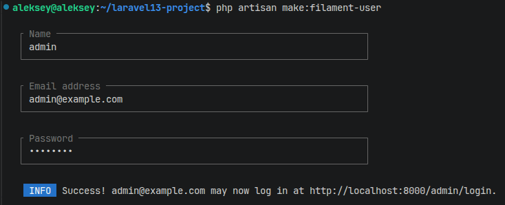

# 🛒 Marketplace Enterprise Core (Laravel 13 DDD)

Высокомасштабируемое бэкенд-ядро (REST API) для мультивендорного маркетплейса. Проект реализован с использованием **Domain-Driven Design (DDD)**, **CQRS** и **Event-Driven Architecture** для обеспечения максимальной изоляции бизнес-логики и отказоустойчивости под высокой нагрузкой.

---

## 🏗️ Архитектурный стек и Senior-паттерны

* **Domain-Driven Design (DDD):** Кодовая база разделена на независимые бизнес-домены внутри директории `src/Domain/` (`Products`, `Orders`). Слой HTTP (контроллеры и запросы) изолирован в папке `app/`.
* **Laravel 13 Native Attributes:** Для конфигурации Eloquent-моделей (таблицы, связи, заполняемые поля `Fillable` и кастинги типов) используются современные PHP-атрибуты вместо классических защищенных массивов.
* **Строгая типизация (DTO):** Передача данных между HTTP-слоем и бизнес-логикой осуществляется через строго типизированные объекты переноса данных (`ProductData`, `OrderData`), что исключает использование "слепых" массивов.
* **Защита от Race Conditions (ACID):** Оформление заказов со списанием остатков товаров защищено на уровне СУБД с помощью пессимистической блокировки строк (`lockForUpdate`) внутри атомарных транзакций.
* **Event-Driven Architecture:** Тяжелые побочные процессы (отправка уведомлений, интеграция с CRM) вынесены в асинхронные фоновые очереди через механизм доменных событий (`OrderCreated`).
* **Паттерн Strategy (Изоляция инфраструктуры):** Слой платежных систем полностью абстрагирован через интерфейсы (`PaymentGatewayInterface`). Приложение работает с контрактом, что позволяет сменить эквайринг (Stripe, ЮKassa) изменением одной строки в `.env`.
* **CQRS и Оптимизация чтения:** Логика вывода каталога вынесена в отдельные Query-классы и оптимизирована умным кэшированием с автоматической инвалидацией (сбросом кэша) при создании или изменении товаров.
* **Безопасность (RBAC):** Доступ к API защищен токенами `Laravel Sanctum`, а права ролей (`customer` / `vendor`) строго разграничены на уровне классов `Laravel Policies`.

---

## 🚀 Инструкция по развертыванию и запуску

### 1. Установка зависимостей и настройка окружения
```bash
composer install
cp .env.example .env
php artisan key:generate
```

### 2. Запуск сервера
Запустите локальный сервер разработки с помощью встроенной команды:
```bash
php artisan serve
```


### 3. Автоматическое тестирование (TDD)
В проекте реализовано 100% покрытие критически важных бизнес-процессов интеграционными и функциональными тестами (валидация запросов, транзакционное списание стоков, симуляция платежного шлюза, кэширование каталога и проверка ролей):
```bash
php artisan test
```

---

## 🖥️ Панель администрирования (Filament v3)

В проект интегрирована профессиональная административная экосистема **Filament PHP** (TALL Stack), предоставляющая менеджерам аналитический дашборд и инструменты модерации контента.

* **Адрес панели:** `http://localhost:8000/admin`


Пользователь для панели Filament создается через стандартную консольную команду:
```bash
php artisan make:filament-user
```

_Примечание безопасности: В соответствии с политикой `User::canAccessPanel`, вход в административную панель разрешен только для аккаунта с email `admin@example.com`._

---

## 📊 Наполнение базы данных (Seeders & Factories)

В проект добавлен комплексный сидер базы данных и фабрики, учитывающие DDD-структуру моделей. Сидер автоматически генерирует демонстрационных продавцов, покупателей, товары с UUID-ключами и распределенные по календарю заказы для прогрева графиков аналитического дашборда.

Чтобы полностью очистить базу данных и наполнить её тестовыми данными, выполните:
```bash
php artisan migrate:fresh --seed
```


---

## 🗂️ Спецификация API Эндпоинтов (REST API)

### Аутентификация
* `POST /api/auth/register` — Регистрация нового пользователя с указанием роли (`customer` или `vendor`). Возвращает Bearer токен.

### Каталог товаров (Домен Products)
* `GET /api/products` — Публичный просмотр каталога (Пагинированный вывод + Тегированный кэш).
* `POST /api/products` — Создание нового товара. Доступно только для пользователей с ролью `vendor` (Защищено `ProductPolicy`, требуется Bearer Token).

### Заказы и платежи (Домен Orders & Infrastructure)
* `POST /api/orders` — Оформление заказа со списанием остатков (Требуется Bearer Token). Автоматически рассчитывает стоимость, генерирует UUID и возвращает клиенту уникальную платежную ссылку шлюза.
* `POST /api/webhooks/payment` — Публичный эндпоинт для приема входящих Webhook-уведомлений об оплате от банка. Защищен кастомной подписью `X-Payment-Signature` и паттерном идемпотентности от повторных запросов.
