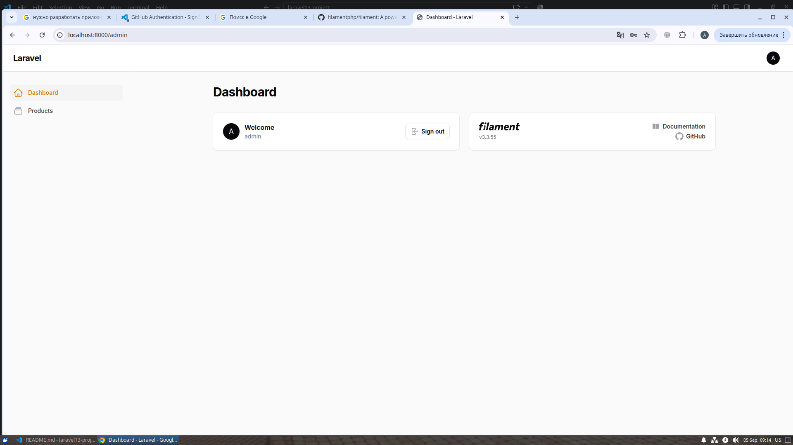

## Запуск сервера
```bash
php artisan serve
```


## Имеется тест
```bash
php artisan test
```

## В проект добавлен flilament
http://localhost:8000/admin

Пользователь для filament создан так
```bash
php artisan make:filament-user
```